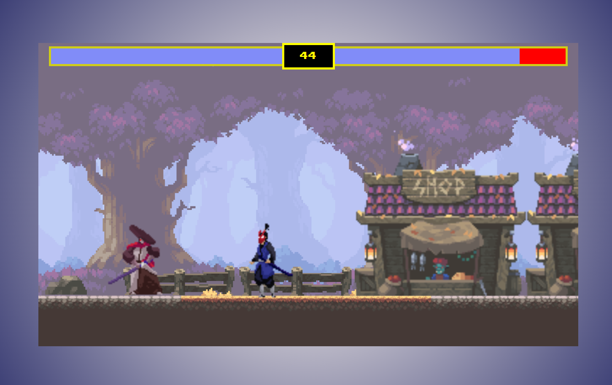

# 🎮 Exciting Multiplayer Game Now Live! 🚀

Welcome to the world of competitive gaming! Introducing our brand new HTML Canvas Multiplayer Game, where you can challenge your friends and have a blast!

## 🌟 Key Features

- 🎉 Engaging gameplay with HTML5 canvas and [mention any libraries/frameworks].
- 🕹️ Real-time multiplayer action for endless fun.
- 🏆 Compete against players from around the world and climb the leaderboard.
- 🚀 Responsive design that works seamlessly on all devices.
- 🎵 Dynamic soundtrack and immersive sound effects.

## 🎯 How to Play

1. Visit [the game link](https://your-game-url-on-netlify.com).
2. Create or join a multiplayer room.
3. [Briefly explain the basic controls or gameplay mechanics.]

## 🤝 Contributing

We welcome contributors to help us improve the game! If you'd like to contribute, check out our [contribution guidelines](CONTRIBUTING.md).

## 📷 In-Game Screenshots

## 📝 License

This project is licensed under the [License Name] License. See the [LICENSE](LICENSE) file for details.

Spread the word and start playing now! 🎮💥
